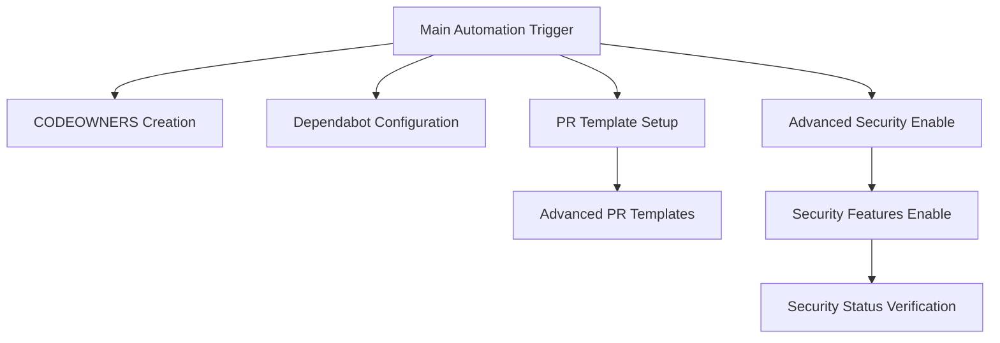

# GitHub Repository Automation - Complete Guide

## 📋 Table of Contents

1. [Overview](#overview)
2. [Automated Features](#automated-features)
3. [Manual Configuration Requirements](#manual-configuration-requirements)
4. [Personal Access Token Setup](#personal-access-token-setup)
5. [Initial Setup Process](#initial-setup-process)
6. [Workflow Architecture](#workflow-architecture)
7. [Security Features](#security-features)
8. [Maintenance and Monitoring](#maintenance-and-monitoring)
9. [Troubleshooting](#troubleshooting)
10. [Best Practices](#best-practices)

---

## Overview

This repository implements a comprehensive GitHub automation system that provides enterprise-grade repository management, security features, and development workflow automation. The system is designed to work across multiple programming ecosystems (Node.js, Python, Java) and provides both basic and advanced automation capabilities.

### 🎯 **Automation Goals**
- **Zero-touch repository setup** for new projects
- **Automated security feature enablement** and monitoring
- **Context-aware dependency management** across multiple ecosystems
- **Standardized pull request workflows** with dynamic templates
- **Continuous security monitoring** and compliance verification

---

## Automated Features

### ✅ **Fully Automated Components**

#### 1. **CODEOWNERS Management**
- **What it does**: Automatically creates and maintains `.github/CODEOWNERS` file
- **Automation level**: 100% automated
- **Triggers**: Every push to main, manual dispatch, weekly schedule
- **File location**: `.github/workflows/ensure-codeowners.yml`
- **Configuration**: Set owner via workflow input (default: `@ajeetchouksey`)

#### 2. **Dependabot Configuration**
- **What it does**: Creates comprehensive `dependabot.yml` configuration
- **Automation level**: 100% automated with ecosystem detection
- **Supported ecosystems**: 
  - npm (when `package.json` detected)
  - pip (when `requirements.txt` detected)
  - maven (when `pom.xml` detected)
- **Features**: 
  - Weekly update schedule
  - Configurable PR limits
  - Auto-rebase strategy
  - Version strategy management
- **File location**: `.github/workflows/ensure-dependabot.yml`

#### 3. **Pull Request Templates**
- **What it does**: Creates multiple PR templates for different scenarios
- **Automation level**: 100% automated with dynamic content
- **Templates provided**:
  - Basic PR template (`pull_request_template.md`)
  - Feature-specific template (`PULL_REQUEST_TEMPLATE/feature.md`)
  - Bug fix template (`PULL_REQUEST_TEMPLATE/bugfix.md`)
  - Hotfix template (`PULL_REQUEST_TEMPLATE/hotfix.md`)
  - Documentation template (`PULL_REQUEST_TEMPLATE/documentation.md`)
- **Dynamic features**: Auto-inject date and author information
- **File location**: `.github/workflows/ensure-pr-template.yml` & `ensure-pr-templates-advanced.yml`

#### 4. **Advanced Security Features**
- **What it does**: Enables and configures GitHub security features
- **Automation level**: 95% automated (see manual requirements below)
- **Features enabled**:
  - Secret scanning
  - Push protection
  - Advanced security (for private repos)
  - Dependency submission
- **File location**: `.github/workflows/enable-advanced-security.yml` & `enable-security-features.yml`

#### 5. **Security Status Monitoring**
- **What it does**: Continuously monitors and verifies security feature status
- **Automation level**: 100% automated
- **Schedule**: Weekly verification on Mondays at 8 AM
- **Reports**: Detailed status reports with actionable insights
- **File location**: `.github/workflows/verify-security-status.yml`

#### 6. **CodeQL Analysis**
- **What it does**: Automated code security analysis
- **Automation level**: 100% automated
- **Supported languages**: JavaScript, Python (configurable)
- **Triggers**: Push, PR, weekly schedule
- **File location**: `.github/workflows/codeql-analysis.yml`

---

## Manual Configuration Requirements

### ⚠️ **Semi-Manual Components**

#### 1. **Dependabot Alerts (Vulnerability Alerts)**
- **Why manual**: GitHub API restrictions for public repositories
- **Required action**: One-time manual enablement via web interface
- **Steps**:
  1. Go to repository Settings → Security & analysis
  2. Find "Dependabot alerts" section
  3. Click "Enable" button
- **Frequency**: One-time setup (persists automatically)
- **Impact**: Critical for vulnerability monitoring

#### 2. **Branch Protection Rules**
- **Why manual**: Requires specific project requirements and team decisions
- **Recommended settings**:
  - Require pull request reviews
  - Require status checks to pass
  - Restrict pushes to main branch
  - Require up-to-date branches
- **Setup location**: Repository Settings → Branches

#### 3. **Repository Secrets Configuration**
- **Why manual**: Security requirement for sensitive data management
- **Required secrets**:
  - `GH_ADMIN_TOKEN`: Personal Access Token with required permissions
- **Setup location**: Repository Settings → Secrets and variables → Actions

---

## Personal Access Token Setup

### 🔑 **Required PAT Permissions**

#### **Classic Personal Access Token Scopes**
Create a new classic PAT with the following scopes:

| Scope | Purpose | Required |
|-------|---------|----------|
| `repo` | Full control of private repositories | ✅ **Essential** |
| `admin:repo_hook` | Full control of repository hooks | ✅ **Essential** |
| `security_events` | Read and write security events | ✅ **Essential** |
| `read:org` | Read org and team membership | ✅ **Essential** |
| `workflow` | Update GitHub Action workflows | ✅ **Essential** |

#### **Fine-grained Personal Access Token Permissions**
If using fine-grained tokens, ensure these permissions:

| Category | Permission | Access Level |
|----------|------------|--------------|
| **Repository permissions** | Administration | Write |
| **Repository permissions** | Contents | Write |
| **Repository permissions** | Issues | Write |
| **Repository permissions** | Metadata | Read |
| **Repository permissions** | Pull requests | Write |
| **Repository permissions** | Security events | Write |
| **Account permissions** | Git SSH keys | Write |

### **PAT Creation Steps**

1. **Navigate to GitHub Settings**
   - Go to GitHub → Settings → Developer settings → Personal access tokens

2. **Create New Token**
   - Click "Generate new token (classic)"
   - Set expiration to 90 days minimum (or no expiration for production)

3. **Configure Scopes**
   - Select all required scopes listed above
   - Provide descriptive note: "GitHub Repository Automation - {Repository Name}"

4. **Store Securely**
   - Copy the generated token immediately
   - Store in password manager or secure location
   - Add to repository secrets as `GH_ADMIN_TOKEN`

---

## Initial Setup Process

### 📚 **Step-by-Step Setup Guide**

#### **Phase 1: Prerequisites** (5 minutes)
1. **Create Personal Access Token**
   - Follow PAT setup guide above
   - Ensure all required scopes are selected

2. **Add Repository Secret**
   - Go to repository Settings → Secrets and variables → Actions
   - Create new secret: `GH_ADMIN_TOKEN`
   - Paste your PAT as the value

#### **Phase 2: Initial Automation Run** (2 minutes)
1. **Trigger Main Automation**
   - Go to Actions tab → "Main Repository Automation"
   - Click "Run workflow" → Select "main" branch → "Run workflow"

2. **Monitor Execution**
   - Watch workflow execution in real-time
   - All jobs should complete successfully except security verification

#### **Phase 3: Manual Security Setup** (2 minutes)
1. **Enable Dependabot Alerts**
   - Go to Settings → Security & analysis
   - Find "Dependabot alerts" → Click "Enable"

2. **Configure Branch Protection (Optional but Recommended)**
   - Go to Settings → Branches
   - Add rule for `main` branch with recommended settings

#### **Phase 4: Verification** (1 minute)
1. **Re-run Main Automation**
   - Trigger the workflow again to verify all features
   - Security verification should now pass completely

2. **Review Generated Files**
   - Check `.github/CODEOWNERS`
   - Review `.github/dependabot.yml`
   - Examine PR templates in `.github/PULL_REQUEST_TEMPLATE/`

**Total Setup Time: ~10 minutes**

---

## Workflow Architecture

### 🏗️ **Main Automation Workflow**

The `main-automation.yml` orchestrates all repository automation:



#### **Workflow Dependencies**
- **Sequential**: PR templates (basic → advanced)
- **Sequential**: Security (advanced security → features → verification)
- **Parallel**: CODEOWNERS, Dependabot (independent)

#### **Execution Strategy**
- **Concurrency**: Limited to one run per branch
- **Cancel in progress**: Enabled for efficiency
- **Retry logic**: Built into individual jobs

### **Individual Workflow Purposes**

| Workflow | Purpose | Frequency | Dependencies |
|----------|---------|-----------|--------------|
| `main-automation.yml` | Master orchestrator | Manual/On-demand | All others |
| `ensure-codeowners.yml` | CODEOWNERS management | Push, Weekly | None |
| `ensure-dependabot.yml` | Dependency automation | Push, Weekly | File detection |
| `ensure-pr-template.yml` | Basic PR template | Push, Weekly | None |
| `ensure-pr-templates-advanced.yml` | Advanced PR templates | Push, Weekly | Basic template |
| `enable-advanced-security.yml` | Security feature setup | Manual | PAT permissions |
| `enable-security-features.yml` | Additional security | Manual | Advanced security |
| `verify-security-status.yml` | Security monitoring | Weekly, Manual | Security features |
| `codeql-analysis.yml` | Code security analysis | Push, PR, Weekly | None |

---

## Security Features

### 🔒 **Implemented Security Measures**

#### **1. Secret Scanning**
- **Status**: ✅ Fully automated
- **Purpose**: Detects secrets committed to repository
- **Coverage**: All commits, real-time scanning
- **Integration**: GitHub Advanced Security

#### **2. Push Protection**
- **Status**: ✅ Fully automated
- **Purpose**: Prevents secret commits before they reach repository
- **Coverage**: All pushes to any branch
- **User experience**: Blocks push with remediation guidance

#### **3. Dependabot Security Updates**
- **Status**: ⚠️ Requires manual enablement
- **Purpose**: Automated security patches for dependencies
- **Coverage**: All package ecosystems (npm, pip, maven)
- **Frequency**: Immediate for security updates

#### **4. CodeQL Analysis**
- **Status**: ✅ Fully automated
- **Purpose**: Static application security testing (SAST)
- **Languages**: JavaScript, Python (expandable)
- **Schedule**: Every push, PR, and weekly deep scan

#### **5. Security Monitoring**
- **Status**: ✅ Fully automated
- **Purpose**: Continuous verification of security feature status
- **Reporting**: Weekly reports with actionable insights
- **Alerting**: Workflow failure notifications for security issues

### **Security Feature Matrix**

| Feature | Public Repos | Private Repos | Manual Setup | API Enabled |
|---------|--------------|---------------|--------------|-------------|
| Secret Scanning | ✅ Auto | ✅ Auto | ❌ | ✅ |
| Push Protection | ✅ Auto | ✅ Auto | ❌ | ✅ |
| Advanced Security | ✅ Always On | ⚠️ Requires License | ❌ | ✅ |
| Dependabot Alerts | ⚠️ Manual Enable | ⚠️ Manual Enable | ✅ | ❌ |
| CodeQL | ✅ Auto | ✅ Auto | ❌ | ✅ |

---

## Maintenance and Monitoring

### 📊 **Ongoing Maintenance Tasks**

#### **Automated Maintenance**
- **Weekly security verification**: Every Monday at 8 AM UTC
- **Dependency updates**: Weekly Dependabot PRs
- **Code quality scans**: Every push and PR
- **Template updates**: Automatic with workflow changes

#### **Recommended Manual Reviews**

##### **Monthly Tasks** (15 minutes)
- [ ] Review Dependabot PRs and merge approved updates
- [ ] Check security alerts and remediate as needed
- [ ] Review CodeQL findings and address issues
- [ ] Update CODEOWNERS if team structure changes

##### **Quarterly Tasks** (30 minutes)
- [ ] Review and update PR templates
- [ ] Audit PAT permissions and rotate if needed
- [ ] Review branch protection rules
- [ ] Update security policies and procedures

##### **Annual Tasks** (1 hour)
- [ ] Comprehensive security audit
- [ ] Review all automation workflows for improvements
- [ ] Update documentation and guides
- [ ] Plan new automation features

### **Monitoring and Alerting**

#### **Built-in Monitoring**
- **Workflow failure notifications**: GitHub automatically notifies on failures
- **Security alert integration**: Real-time notifications for security issues
- **Status badges**: Available for README.md integration

#### **Key Metrics to Track**
- Security workflow success rate
- Dependabot PR merge rate
- CodeQL finding resolution time
- Template usage statistics

---

## Troubleshooting

### 🔧 **Common Issues and Solutions**

#### **Authentication Issues**

**Problem**: Workflow fails with 403 Forbidden or authentication errors
```
Error: Resource not accessible by integration
```

**Solution**:
1. Verify PAT has all required scopes
2. Check PAT expiration date
3. Ensure `GH_ADMIN_TOKEN` secret is correctly set
4. For workflow files, ensure `workflow` scope is included

**Prevention**: Set PAT expiration reminders and use fine-grained tokens when possible

---

#### **Security Feature Enablement Issues**

**Problem**: Security verification fails showing features as disabled
```
❌ Advanced Security: disabled
❌ Vulnerability Alerts: disabled
```

**Solution for Public Repositories**:
1. Advanced Security is always enabled for public repos (API shows "disabled" but features work)
2. Manually enable Dependabot alerts in Settings → Security & analysis
3. Re-run security verification workflow

**Solution for Private Repositories**:
1. Ensure GitHub Advanced Security license is available
2. Enable features via repository settings
3. Verify PAT has `security_events` scope

---

#### **Dependabot Configuration Issues**

**Problem**: Dependabot not creating PRs despite configuration
```
dependabot.yml exists but no PRs are created
```

**Solution**:
1. Verify dependency files exist (package.json, requirements.txt, pom.xml)
2. Check Dependabot alerts are enabled
3. Review dependabot.yml syntax for errors
4. Ensure repository has dependencies that need updates

**Prevention**: Use the context-aware workflow that detects package files automatically

---

#### **Workflow Permission Issues**

**Problem**: Cannot update workflow files
```
403 refusing to allow an OAuth App to create or update workflow
```

**Solution**:
1. Ensure PAT includes `workflow` scope
2. Use fine-grained PAT with workflow permissions
3. Update workflows manually if API restrictions apply

---

#### **CodeQL Analysis Issues**

**Problem**: CodeQL analysis fails or doesn't detect languages
```
No languages found to analyze
```

**Solution**:
1. Verify supported languages are present in repository
2. Update language matrix in workflow file
3. Check file extensions are recognized by CodeQL
4. Add manual build steps if autobuild fails

---

### **Debug Mode**

Enable verbose logging by adding to workflow files:
```yaml
env:
  ACTIONS_STEP_DEBUG: true
  ACTIONS_RUNNER_DEBUG: true
```

---

## Best Practices

### 💡 **Recommended Practices**

#### **Security Best Practices**
1. **Least Privilege**: Use minimum required PAT permissions
2. **Regular Rotation**: Rotate PATs every 90 days
3. **Audit Trail**: Monitor workflow execution logs regularly
4. **Prompt Response**: Address security alerts within 24 hours
5. **Multiple Layers**: Don't rely solely on automated security

#### **Workflow Best Practices**
1. **Test Changes**: Always test workflow modifications in a fork first
2. **Version Control**: Use specific action versions, not `@main`
3. **Error Handling**: Implement proper error handling and notifications
4. **Documentation**: Keep this guide updated with any customizations
5. **Backup Strategy**: Maintain workflow backups outside the repository

#### **Development Workflow Integration**
1. **Branch Strategy**: Use feature branches with this automation
2. **PR Reviews**: Require human review even with automation
3. **Status Checks**: Make security checks required for merging
4. **Team Training**: Ensure team understands automation features
5. **Gradual Rollout**: Implement automation incrementally for large teams

#### **Performance Optimization**
1. **Conditional Execution**: Use file detection to avoid unnecessary runs
2. **Parallel Jobs**: Run independent tasks in parallel
3. **Caching**: Implement caching for dependencies and build artifacts
4. **Scheduling**: Spread scheduled tasks across different times
5. **Resource Limits**: Set appropriate timeouts and resource limits

---

## Appendix

### **Quick Reference Commands**

#### **Manual Workflow Triggers**
```bash
# Trigger main automation
gh workflow run main-automation.yml

# Trigger specific component
gh workflow run ensure-dependabot.yml
gh workflow run verify-security-status.yml

# Check workflow status
gh run list --workflow=main-automation.yml
```

#### **Useful GitHub CLI Commands**
```bash
# Check repository security features
gh api repos/:owner/:repo | jq '.security_and_analysis'

# Enable Dependabot alerts
gh api -X PATCH repos/:owner/:repo -f vulnerability_alerts=true

# List workflow runs
gh run list --limit 10
```

### **File Structure Reference**
```
.github/
├── workflows/                 # Main automation workflows
│   ├── main-automation.yml   # Master orchestrator
│   ├── ensure-*.yml          # Component workflows
│   ├── enable-*.yml          # Security workflows
│   └── verify-*.yml          # Monitoring workflows
├── actions/                   # Custom composite actions
│   ├── ensure-codeowners/
│   ├── ensure-dependabot/
│   └── ensure-pr-template*/
├── scripts/                   # Utility scripts
├── CODEOWNERS                # Auto-generated code ownership
├── dependabot.yml            # Auto-generated dependency config
├── pull_request_template.md  # Basic PR template
├── PULL_REQUEST_TEMPLATE/    # Advanced PR templates
└── SECURITY.md               # Security policy
```

### **Version History**
- **v1.0**: Initial automation implementation
- **v1.1**: Added context-aware ecosystem detection
- **v1.2**: Enhanced security feature automation
- **v1.3**: Improved public repository support
- **Current**: Comprehensive automation with monitoring

---

**Document Version**: 1.3  
**Last Updated**: July 28, 2025  
**Maintained By**: GitHub Copilot Automation System

For questions, issues, or improvements, please open an issue or pull request in this repository.
